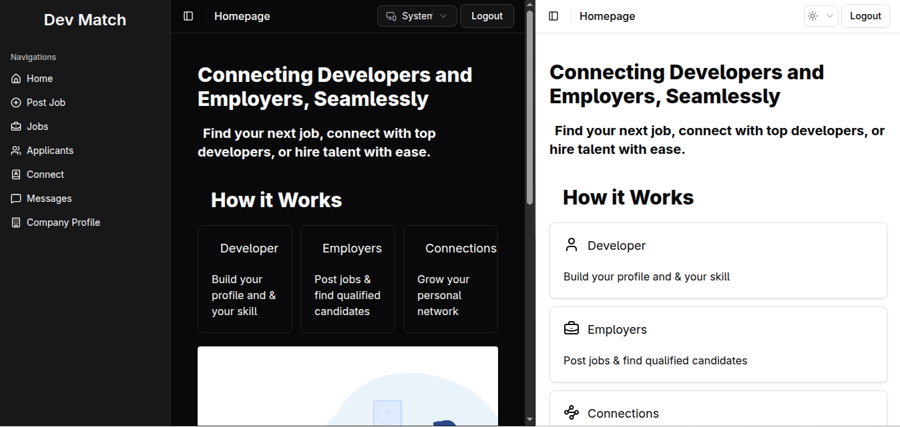
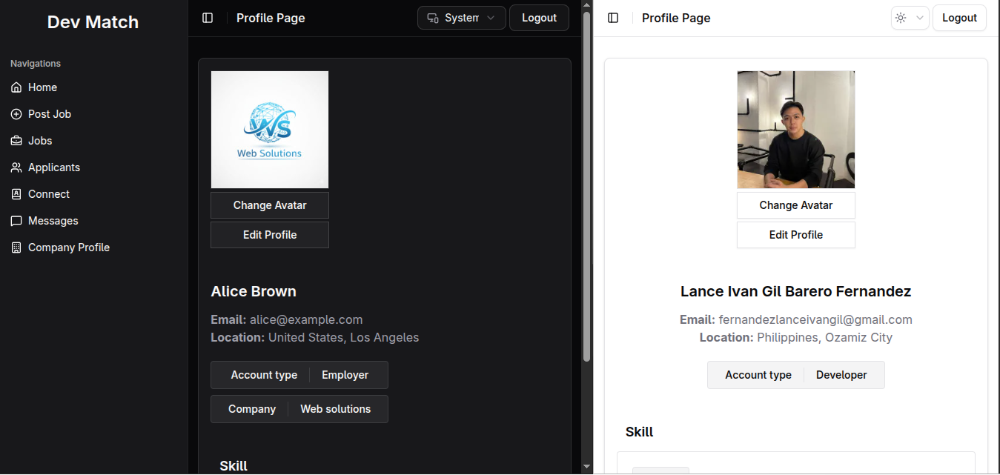
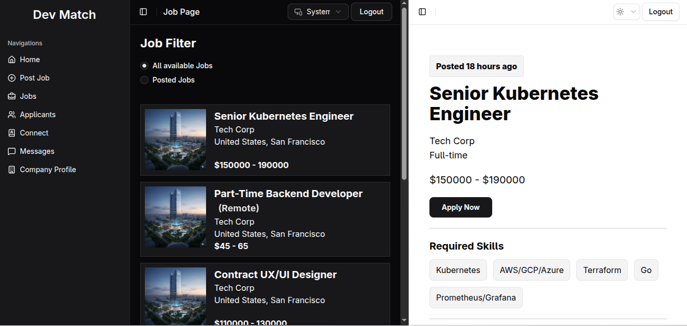
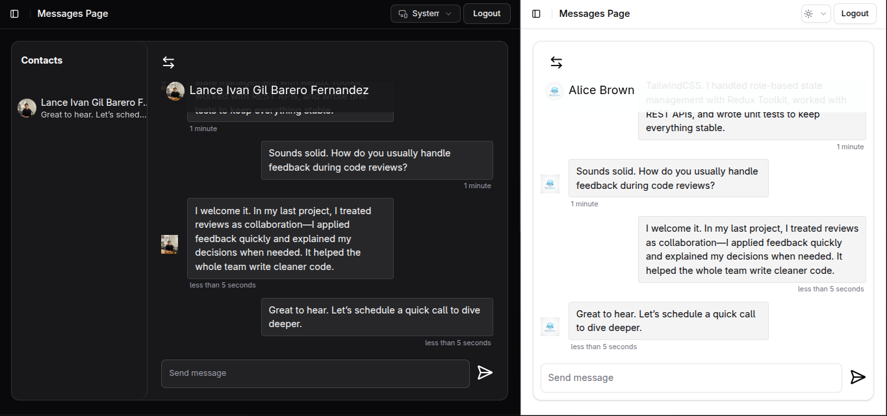
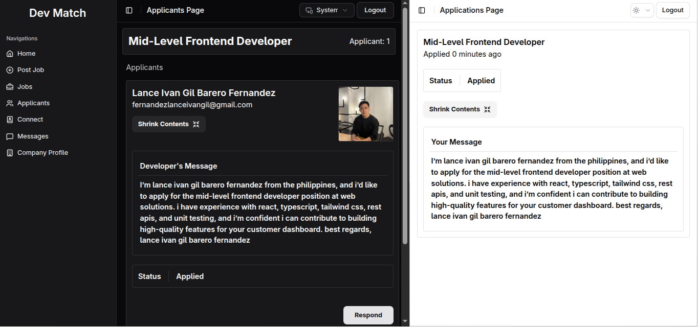

# Dev Match

Dev Match is a jobs marketplace for developers and employers. Developers can discover and apply for jobs, manage applications, and message contacts. Employers can post job openings and review applicants. The app emphasizes professional networking through **Connections** (which unlock messaging) and a Facebook-like contacts list experience.

---

## Application Preview

Here's a glimpse of Dev Match, showcasing key pages in both light and dark modes.

**Homepage**

**Profile Page**

**Jobs and Job Display Page**

**Messages Page**

**Applicants & Applications Pages**

## Table of Contents

1. [Live demo](#live-demo)
2. [Project status](#project-status)
3. [Tech stack](#tech-stack)
4. [What it does (high level)](#what-it-does-high-level)
5. [Pages &amp; role-specific flows](#pages--role-specific-flows)
6. [Usage guide — how to use the app](#usage-guide--how-to-use-the-app)
7. [Architecture &amp; design decisions](#architecture--design-decisions)
8. [Why this project — recruiter highlights](#why-this-project--recruiter-highlights)
9. [Contributing / Contact](#contributing--contact)
10. [Acknowledgements](#acknowledgements)

---

## Live demo

- **Frontend (Vercel):** https://dev-match-xi.vercel.app/
- **Backend (Render):** https://dev-match-c3g0.onrender.com

---

## Project status

**Actively maintained.** The project is intended as a portfolio-grade showcase for frontend + backend skills and is receiving iterative improvements.

---

## Tech stack

- **Frontend:** React, Redux Toolkit, React Router, Shadcn UI components, TailwindCSS, Framer Motion
- **Backend:** Node.js, Express.js, Zod (validation), Socket.io, Cloudinary
- **Database:** PostgreSQL
- **Hosting:** Vercel (frontend), Render (backend)
- **Other:** Sonner for toasts (in-app notifications)

---

## What it does (high level)

- **Connections** — Users send/accept connection requests. When two users are connected, messaging between them is enabled.
- **Messages / Contacts** — Messaging appears in a contact list similar to Facebook: if a user has an existing message thread or is connected to another user, that contact appears in the list.
- **Role separation** — Developer and Employer roles have tailored pages and workflows (available actions, and pages).
- **Job lifecycle** — Employers create job posts; developers browse and apply; employers review applicants.

---

## Pages & role-specific flows

**Shared (all users):**

- `Login` — Authenticate.
- `Register` — Create an account (role selection: developer or employer).
- `Home` — Overview feed / quick access.
- `Jobs` — Job listings and filters.
- `Job display` — Full job description; actions like apply.
- `Connect` — Discover other users and send connection requests.
- `Messages` — Messaging UI to read/send messages to contacts.
- `Profile` — Developer/Employer profile (skills, experience, portfolio links).

**Developer-only:**

- `Applications` — List of jobs the developer applied to, application status.

**Employer-only:**

- `Job Post` — Create / manage job postings.
- `Applicants` — View and manage applications for a specific job.

---

## Usage guide — how to use the app

This section explains typical flows for each user type.

### For Developers

1. **Register / Login**
   - Sign up as _Developer_ and fill profile fields (skills, experience, links).
2. **Discover jobs**
   - Go to `Jobs` to explore listings. Use filters to narrow results.
3. **View a job**
   - Open `Job display` to see the full description, requirements, and employer details.
4. **Apply**
   - Click `Apply` on the job page to submit an application. Applications appear in your `Applications` page.
5. **Connect & Message**
   - Visit `Connect` to find other users. Send connection requests to employers or other developers.
   - After connecting (or if you already have a message thread), the contact will appear in the `Messages` contact list. Open a thread to chat.

### For Employers

1. **Register / Login**
   - Sign up as _Employer_ and complete company details.
2. **Post a job**
   - Use `Job Post` to create a new listing (title, description, requirements, location, salary range).
3. **Review applicants**
   - Open `Applicants` for a posted job to review candidate profiles and application materials.
4. **Connect & Message**
   - You can connect with developers from applicant lists or via the `Connect` page. Messaging unlocks when connected or when a message thread exists.

### Connections & Messaging rules (short)

- Messaging is available if:
  - Users are connected (accepted connection), or
  - There is already an existing message thread between users.
- Contacts list includes:
  - Users you are connected with, and
  - Users with an existing message thread.

---

## Architecture & design decisions

- **State management** — Redux Toolkit centralizes global app state (auth, user profiles, jobs), while React's Context API is used for more localized state, such as in the messaging UI.
- **Component system** — Shadcn UI components + TailwindCSS for a consistent, minimal, and accessible component library.
- **Animations** — Framer Motion adds subtle, professional motion to UI transitions and micro-interactions.
- **Validation** — Zod is used server-side for robust schema validation.
- **Database** — PostgreSQL for reliable relational storage (users, jobs, applications, connections, messages).
- **Separation of concerns** — Frontend solely handles UI + state; backend exposes RESTful (or REST-like) endpoints for auth, jobs, connections, messages, and applications.

---

## Why this project — recruiter highlights

This project demonstrates practical, portfolio-relevant skills:

- Building role-based user experiences (developer vs employer).
- Designing social features (connections) and controlled messaging access—shows thought about privacy and UX gating.
- Managing application state with **Redux Toolkit** — skills applicable to large-scale frontends.
- Using **TailwindCSS** + **Shadcn** to create crisp, componentized UI.
- Implementing motion and polish with **Framer Motion** .
- Backend design with Node/Express and input validation using **Zod** ; production-ready DB with **PostgreSQL.**
- Deployment and CI-awareness (frontend hosted on Vercel; backend on Render).

---

## Roadmap (examples — adapt as needed)

- Notifications center (in-app + email)
- Skill-based job matching / recommendations
- Advanced filters and saved searches for jobs
- Company profiles and employer verification
- Tests: unit / integration tests for critical flows

---

## Contributing / Contact

Contributions are welcome! If you have suggestions for improvements or want to fix a bug, please feel free to open an issue or submit a pull request.

- **Report a bug:** [Open an issue](https://github.com/kenshiin1123/dev-match/issues)
- **Contact:** You can reach me at [fernandezlanceivangil@gmail.com](mailto:fernandezlanceivangil@gmail.com) or connect on [LinkedIn](https://www.linkedin.com/in/lance-ivan-gil-fernandez-67bb02268/).

---

## Acknowledgements

Thanks to the open-source ecosystem (React, Redux Toolkit, TailwindCSS, Framer Motion, Node, Express, Zod, PostgreSQL). UI and UX inspiration drawn from modern professional networks.
